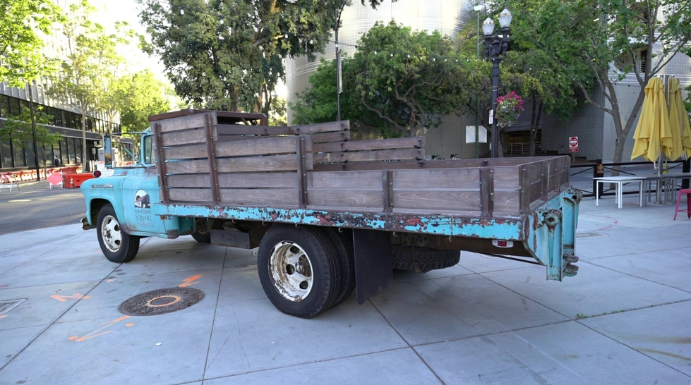
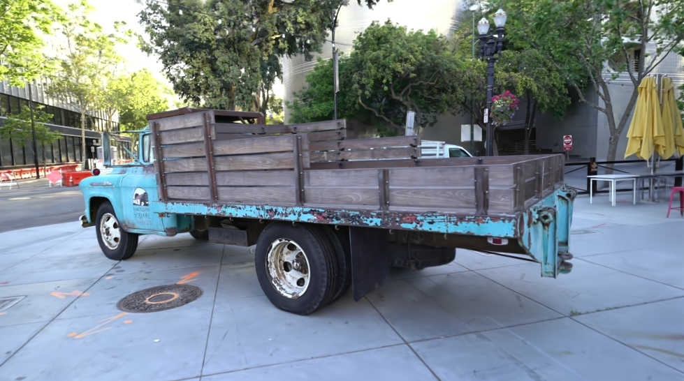
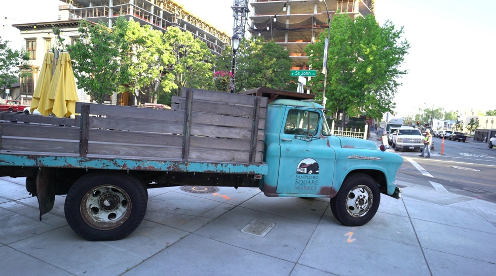
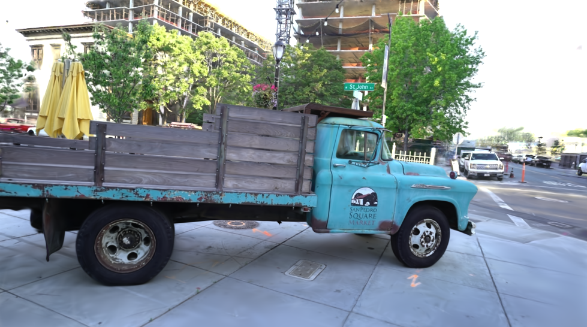
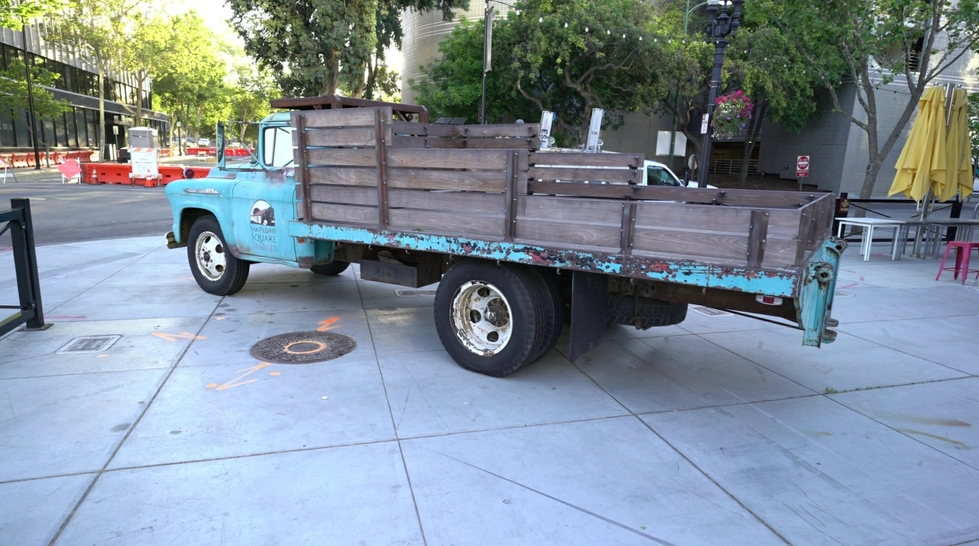
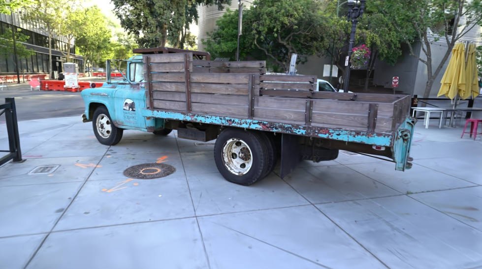

# Gaussian Splatting 実験結果

## 実験概要

| 項目 | 値 |
|-----|-----|
| 実験日 | 2026-01-29 |
| シーン | Tanks & Temples - Truck |
| GPU | NVIDIA GeForce RTX 4090 (48GB) |
| PyTorch | 2.6.0+cu124 |
| CUDA | 12.4 |

## データセット

| 項目 | 値 |
|-----|-----|
| データセット名 | T&T+DB COLMAP |
| シーン | truck |
| 入力画像数 | 251枚 |
| 画像解像度 | 1957 x 1091 |
| データソース | [公式リンク](https://repo-sam.inria.fr/fungraph/3d-gaussian-splatting/datasets/input/tandt_db.zip) |

## 学習設定

```bash
python train.py -s data/tandt/truck -m output/truck --iterations 7000
```

| パラメータ | 値 |
|-----------|-----|
| イテレーション数 | 7,000 |
| 解像度 | 自動（オリジナル） |
| Densify until iter | 15,000（デフォルト） |
| 学習率 | デフォルト |

## 学習結果

| 項目 | 値 |
|-----|-----|
| 学習時間 | 約3分 |
| 最終ガウシアン数 | 約200万点 |
| モデルサイズ | 402 MB |
| 総出力サイズ | 773 MB |

### 出力ファイル

```
output/truck/
├── point_cloud/
│   └── iteration_7000/
│       └── point_cloud.ply    # 402 MB - 3Dガウシアンモデル
├── train/
│   └── ours_7000/
│       ├── renders/           # 251枚のレンダリング画像
│       └── gt/                # 251枚の元画像
├── cameras.json               # カメラパラメータ
├── cfg_args                   # 学習設定
├── exposure.json              # 露出補正データ
└── input.ply                  # 入力点群
```

## 推論（レンダリング）結果

```bash
python render.py -m output/truck
```

| 項目 | 値 |
|-----|-----|
| レンダリング時間 | 約1分40秒 |
| 出力画像数 | 251枚 |
| 平均レンダリング速度 | 約2.5 fps |
| 出力画像形式 | PNG |

## サンプル画像

### 視点1（後方から）

| Ground Truth | Rendered |
|-------------|----------|
|  |  |

### 視点2（正面から）

| Ground Truth | Rendered |
|-------------|----------|
|  |  |

### 視点3（斜め前方から）

| Ground Truth | Rendered |
|-------------|----------|
|  |  |

## 考察

### 良かった点

1. **高速な学習**: RTX 4090 で 7,000 イテレーションが約3分で完了
2. **高品質なレンダリング**: 元画像とほぼ同等の品質
3. **詳細な再現**: トラックの塗装の剥がれ、木製荷台の質感まで再現

### 改善の余地

1. **イテレーション数**: 7,000 は動作確認用。論文品質には 30,000 推奨
2. **評価メトリクス**: PSNR/SSIM/LPIPS の定量評価は未実施

## 再現手順

```bash
# 1. データセット準備
cd /workspace/gaussian-splatting
mkdir -p data && cd data
wget https://repo-sam.inria.fr/fungraph/3d-gaussian-splatting/datasets/input/tandt_db.zip
unzip tandt_db.zip
cd ..

# 2. 学習
CUDA_HOME=/venv/gaussian_splatting mamba run -n gaussian_splatting \
  python train.py -s data/tandt/truck -m output/truck --iterations 7000

# 3. レンダリング
CUDA_HOME=/venv/gaussian_splatting mamba run -n gaussian_splatting \
  python render.py -m output/truck

# 4. 結果確認
ls output/truck/train/ours_7000/renders/
```

## 参考

- [3D Gaussian Splatting 公式リポジトリ](https://github.com/graphdeco-inria/gaussian-splatting)
- [論文](https://repo-sam.inria.fr/fungraph/3d-gaussian-splatting/)
